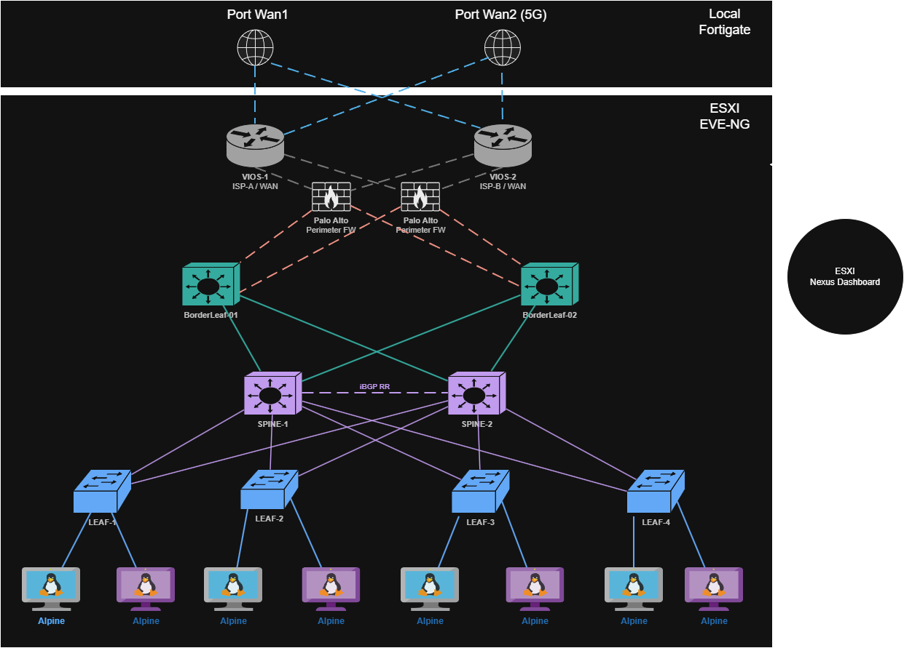

I have been doing a lot of data center network design work lately, and I figured the best way to actually own the concepts is to build it from scratch in a lab. Not a stripped-down three-node demo — a proper, production-representative topology that covers everything: underlay routing, VXLAN overlay, BGP EVPN control plane, multi-tenant VRFs, border leaf design, dual firewall HA, and dual ISP connectivity as best as i posibiliy can.

This is part one of a x post series. In this post i will walk through the full topology, explain every design decision, and lay out the IP addressing plan. Then, over the following posts, we will configure every layer from scratch — and I will show you the exact commands, the verification steps, and all the holes i fall in to.


## Why Spine-Leaf?

Before we dive into the topology, it is worth asking why spine-leaf has become the de-facto standard for modern data center networks.

The classic three-tier architecture — core, distribution, access — was designed for north-south traffic. Client talks to server, server responds. It made sense when the data center was mostly a place where users accessed applications remotely. But in modern environments, the dominant traffic pattern is east-west: server to server, container to container, microservice to microservice. Three-tier handles this poorly. Traffic from one rack to another can traverse multiple hops, and spanning tree creates active/blocked topologies that waste bandwidth.

Spine-leaf fixes this with a simple rule: **every leaf connects to every spine, and nothing else**. The result is a flat, predictable two-hop topology — any endpoint can reach any other endpoint in exactly two hops regardless of scale. All links are active (no STP blocking), ECMP is trivial to implement, and you add capacity by adding leaves without redesigning anything. So this means it is very scalable.

Add VXLAN on top and you get a Layer 2 overlay that spans the entire fabric without the limitations of physical VLANs. Add BGP EVPN as the control plane and you get scalable, distributed MAC and IP learning with built-in multi-tenancy. This is the architecture running inside AWS, Google, Facebook, and most modern enterprise data centers.


## The Lab Topology

This is what i am planning to build within these blog posts:



Let me walk through each layer of the onion.


## Node Inventory

| Node | Image | RAM | Purpose |
|---|---|---|---|
| SPINE-1 | nxosv9k-10.3.1 | 6 GB | IS-IS underlay, iBGP RR |
| SPINE-2 | nxosv9k-10.3.1 | 6 GB | IS-IS underlay, iBGP RR |
| BorderLeaf-1 | nxosv9k-10.3.1 | 6 GB | Border leaf, VTEP, VRF-leak |
| BorderLeaf-2 | nxosv9k-10.3.1 | 6 GB | Border leaf, VTEP, VRF-leak |
| LEAF-1 | nxosv9k-10.3.1 | 6 GB | VTEP, TENANT-A |
| LEAF-2 | nxosv9k-10.3.1 | 6 GB | VTEP, TENANT-A + B |
| LEAF-3 | nxosv9k-10.3.1 | 6 GB | VTEP, TENANT-A + B |
| LEAF-4 | nxosv9k-10.3.1 | 6 GB | VTEP, TENANT-B |
| VIOS-1 | vios-adv...m8 | 1 GB | Simulated ISP-A |
| VIOS-2 | vios-adv...m8 | 1 GB | Simulated ISP-B |
| PAN-1 | PAN-VM | 4 GB | Firewall HA active |
| PAN-2 | PAN-VM | 4 GB | Firewall HA passive |
| ALPINE ×8 | alpine-3.18.4 | 4 GB | Tenant workloads |
| **Total** | | **~90 GB** | |

I am using **90 GB** of RAM for this deployment in the EVE-NG host. But If you are running tight, you can reduce each Nexus node to 4 GB, VIOS could also be reduced to atleast 512MB, and according to eve-ng doc linux tinycore instead of alpine for the workloads can run with 512MB ram for each of the hosts.

I have kept PAN-VMs at 4 GB, because Palo Alto firewalls are running bad with less than this, if you reduce like i told above you will land at 45GB ram.

---

### External Layer — Dual ISP

**VIOS-1** and **VIOS-2** simulate two separate ISPs. Each runs eBGP toward the Palo Alto HA pair and advertises a default route into the fabric. This lets us explore BGP path selection, AS-path prepending for active/standby WAN, and what happens when one ISP goes down.

I am using Cisco VIOS (`vios-adventerprisek0-m.spa.159-3.m8`) it is lightweight and more than capable for simulating an upstream provider.

### Perimeter — Palo Alto HA Pair

**PAN-1** and **PAN-2** run as an active/passive HA pair. The HA1 link handles heartbeat and configuration synchronization between the two units. The HA2 link synchronizes the session table so that a failover is stateful — active sessions survive a PAN-1 failure.

Both firewalls connect dual-homed into BorderLeaf-1 and BorderLeaf-2, which means firewall traffic is distributed across both border leafs in steady state, and survives either a single firewall or single border leaf failure.

<!-- IMAGE: Palo Alto HA detail — HA1/HA2 links, active/passive state, dual connections to BorderLeaf-1 and BorderLeaf-2 -->

### Border Leaf — BorderLeaf-1 and BorderLeaf-2

The border leafs are where the fabric meets the outside world. They are full VTEPs (they participate in the VXLAN overlay) but they also terminate the connection toward the firewall and run VRF-leaking to move traffic between tenant VRFs and the external routing domain.

We are running **two border leafs** rather than one for HA. In production this is the standard — a single border leaf is a single point of failure for all north-south traffic. With two, we can do active/active ECMP toward the firewall or active/standby using BGP local-preference tuning.

BorderLeaf-1 and BorderLeaf-2 also originate **EVPN Type-5** IP prefix routes into the fabric, advertising the default route learned from the firewall to all VTEPs downstream.

### Spine Layer — SPINE-1 and SPINE-2

The spines are deliberately simple. They run no VTEPs and hold no tenant state. Their job is:

1. Forward underlay IP packets between leafs and border leafs
2. Act as **iBGP Route Reflectors** for EVPN

That second point is important. In a large fabric you dont want every VTEP to peer with every other VTEP (that's O(n²) BGP sessions). Instead, the spines act as route reflectors — every leaf and border leaf opens a single iBGP session toward each spine, and the spines reflect EVPN routes between them. Two spines means redundant RR coverage.

The underlay routing protocol is **IS-IS**. More on that in post 2.

### Leaf Layer — LEAF-1 through LEAF-4

The four access leafs are where the actual tenant workloads connect. Each is a full VTEP (VXLAN Tunnel Endpoint). They encapsulate and decapsulate VXLAN traffic, run BGP EVPN toward the spines, and provide **anycast gateway** functionality — meaning every leaf has the same MAC and IP address for the default gateway of each VLAN, so hosts can be moved between leafs without reconfiguring their gateway.

LEAF-1 and LEAF-4 are single-tenant (VRF-A and VRF-B respectively). LEAF-2 and LEAF-3 host both tenants, which lets us test inter-VRF routing and verify that tenant isolation actually works.
In short: LEAF-1 and 4 are "clean" zones, while LEAF-2 and 3 are where the advanced routing and security testing happens.

### Hosts — Alpine Linux × 8

Two Alpine Linux clients per leaf, spread across the two tenant VRFs. Small, fast to boot, and perfect for `ping`, `iperf3`, and testing. The distribution across leafs and VRFs gives us meaningful test cases: L2 reachability within a VNI, L3 routing between VNIs in the same VRF, and the enforcement of tenant isolation between VRF-A and VRF-B.

## IP Addressing Plan

### Loopbacks

| Node | Lo0 (Router-ID) | Lo1 (VTEP Source) | IS-IS NET |
|---|---|---|---|
| SPINE-1 | 10.0.0.1/32 | — | `49.0001.0100.0000.0001.00` |
| SPINE-2 | 10.0.0.2/32 | — | `49.0001.0100.0000.0002.00` |
| BLEAF-1 | 10.0.0.3/32 | 10.1.0.3/32 | `49.0001.0100.0000.0003.00` |
| BLEAF-2 | 10.0.0.4/32 | 10.1.0.4/32 | `49.0001.0100.0000.0004.00` |
| LEAF-1 | 10.0.0.11/32 | 10.1.0.11/32 | `49.0001.0100.0000.0011.00` |
| LEAF-2 | 10.0.0.12/32 | 10.1.0.12/32 | `49.0001.0100.0000.0012.00` |
| LEAF-3 | 10.0.0.13/32 | 10.1.0.13/32 | `49.0001.0100.0000.0013.00` |
| LEAF-4 | 10.0.0.14/32 | 10.1.0.14/32 | `49.0001.0100.0000.0014.00` |

The IS-IS NET is derived mechanically from the loopback IP — pad each octet to three digits and group into four-digit IS-IS system-ID blocks. 10.0.0.11 becomes `0100.0000.0011`. This makes it easy to decode a NET back to a node identity at a glance.

### Fabric P2P Links (IS-IS underlay)

All fabric links run /31 prefixes on point-to-point interfaces. No broadcast, no DR election, minimal waste.

| Link | Spine/BLEAF side | Leaf/BLEAF side |
|---|---|---|
| SPINE-1 ↔ LEAF-1 | 192.168.1.0/31 | 192.168.1.1/31 |
| SPINE-1 ↔ LEAF-2 | 192.168.1.2/31 | 192.168.1.3/31 |
| SPINE-1 ↔ LEAF-3 | 192.168.1.4/31 | 192.168.1.5/31 |
| SPINE-1 ↔ LEAF-4 | 192.168.1.6/31 | 192.168.1.7/31 |
| SPINE-1 ↔ BLEAF-1 | 192.168.1.8/31 | 192.168.1.9/31 |
| SPINE-1 ↔ BLEAF-2 | 192.168.1.10/31 | 192.168.1.11/31 |
| SPINE-2 ↔ LEAF-1 | 192.168.2.0/31 | 192.168.2.1/31 |
| SPINE-2 ↔ LEAF-2 | 192.168.2.2/31 | 192.168.2.3/31 |
| SPINE-2 ↔ LEAF-3 | 192.168.2.4/31 | 192.168.2.5/31 |
| SPINE-2 ↔ LEAF-4 | 192.168.2.6/31 | 192.168.2.7/31 |
| SPINE-2 ↔ BLEAF-1 | 192.168.2.8/31 | 192.168.2.9/31 |
| SPINE-2 ↔ BLEAF-2 | 192.168.2.10/31 | 192.168.2.11/31 |

### WAN and Firewall Links

| Link | Address |
|---|---|
| VIOS-1 ↔ PAN-1 (outside) | 100.64.1.0/30 |
| VIOS-2 ↔ PAN-2 (outside) | 100.64.2.0/30 |
| PAN-1 (inside) ↔ BLEAF-1 | 192.168.3.0/30 |
| PAN-2 (inside) ↔ BLEAF-2 | 192.168.3.4/30 |
| PAN HA1 (mgmt sync) | 192.168.100.0/30 |
| PAN HA2 (session sync) | 192.168.101.0/30 |

### Tenant Subnets

| VRF | L3 VNI | VLAN | L2 VNI | Subnet | Gateway (anycast) |
|---|---|---|---|---|---|
| TENANT-A | 50001 | 10 | 10010 | 172.16.10.0/24 | 172.16.10.1 |
| TENANT-A | 50001 | 11 | 10011 | 172.16.11.0/24 | 172.16.11.1 |
| TENANT-B | 50002 | 20 | 10020 | 172.16.20.0/24 | 172.16.20.1 |
| TENANT-B | 50002 | 21 | 10021 | 172.16.21.0/24 | 172.16.21.1 |

---

## Cabling Summary

<!-- IMAGE: Physical cabling diagram with interface labels — e1/1, e1/2 etc on each node -->

```
# Spine-to-leaf full mesh (16 links)
SPINE-1 e1/1  ──  LEAF-1  e1/1       SPINE-2 e1/1  ──  LEAF-1  e1/2
SPINE-1 e1/2  ──  LEAF-2  e1/1       SPINE-2 e1/2  ──  LEAF-2  e1/2
SPINE-1 e1/3  ──  LEAF-3  e1/1       SPINE-2 e1/3  ──  LEAF-3  e1/2
SPINE-1 e1/4  ──  LEAF-4  e1/1       SPINE-2 e1/4  ──  LEAF-4  e1/2
SPINE-1 e1/5  ──  BLEAF-1 e1/1       SPINE-2 e1/5  ──  BLEAF-1 e1/2
SPINE-1 e1/6  ──  BLEAF-2 e1/1       SPINE-2 e1/6  ──  BLEAF-2 e1/2

# Firewall connections (8 links)
BLEAF-1 e1/3  ──  PAN-1 eth1         BLEAF-2 e1/3  ──  PAN-2 eth1
BLEAF-1 e1/4  ──  PAN-2 eth2         BLEAF-2 e1/4  ──  PAN-1 eth2
PAN-1   eth3  ──  VIOS-1 e0/1        PAN-2   eth3  ──  VIOS-2 e0/1
PAN-1   eth4  ──  PAN-2  eth4  (HA1)
PAN-1   eth5  ──  PAN-2  eth5  (HA2)

# Access links to hosts (8 links)
LEAF-1  e1/3  ──  ALPINE-1A          LEAF-1  e1/4  ──  ALPINE-1B
LEAF-2  e1/3  ──  ALPINE-2A          LEAF-2  e1/4  ──  ALPINE-2B
LEAF-3  e1/3  ──  ALPINE-3A          LEAF-3  e1/4  ──  ALPINE-3B
LEAF-4  e1/3  ──  ALPINE-4A          LEAF-4  e1/4  ──  ALPINE-4B
```

---

## What This Series Covers

Each post builds on the previous one. You can follow along from start to finish, or jump to a specific topic if you already have the earlier layers running.

Plan in the end is to create the whole lab with the help of Ansible.

| Post | Topic | Key concepts |
|---|---|---|
| **1 (this post)** | Architecture and topology | Spine-leaf design, IP plan |
| **2** | IS-IS underlay | IS-IS Level-2, /31 P2P links, ECMP |
| **3** | OSPF vs IS-IS | Protocol comparison, convergence tuning |
| **4** | BFD | Sub-second failure detection |
| **5** | VXLAN Flood and Learn | VNI, VTEP, NVE, BUM traffic |
| **6** | BGP EVPN control plane | iBGP RR, EVPN address family, route types |
| **7** | EVPN L2 VNI | Anycast gateway, ARP suppression, no STP |
| **8** | EVPN L3 VNI | Symmetric IRB, VRF, multi-tenancy |
| **9** | Border leaf and eBGP | VRF leaking, Type-5 routes, dual ISP |
| **10** | Palo Alto HA and service insertion | Zone policy, NAT, stateful failover |

---

## Up Next

In post 2, we start configuring. The first thing we build is the IS-IS underlay — hostname, loopbacks, /31 P2P interfaces, and IS-IS process on all eight NX-OS nodes. By the end of that post every loopback in the fabric will be reachable from every other node via two equal-cost paths, and you'll be able to see ECMP in the routing table.

See you there.

---

*Got questions about the design or running into issues in your own lab? Drop a comment below — I would love to hear what you are building.*
