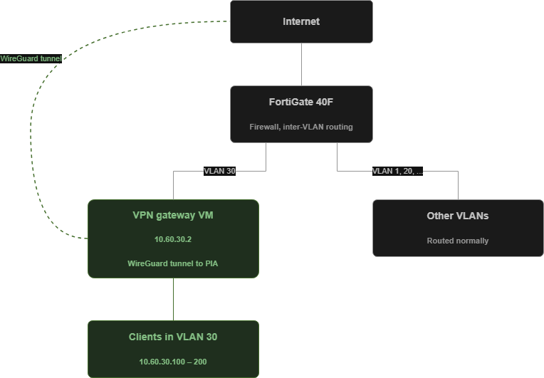
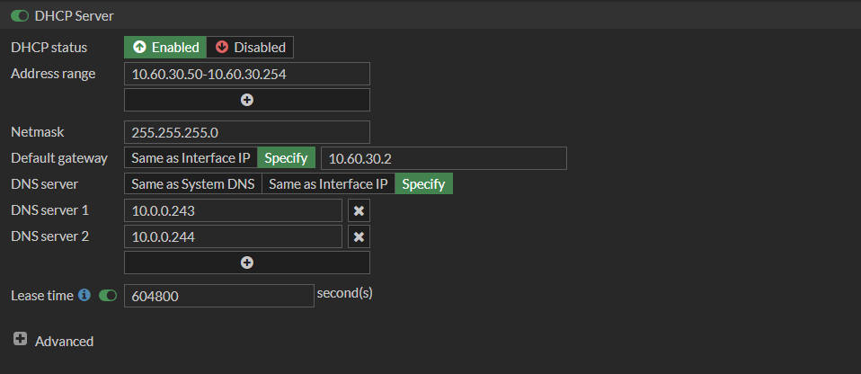
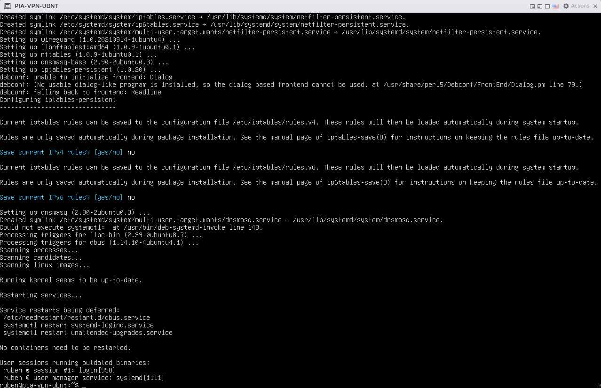
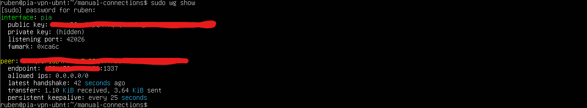

I have wanted a clean way to send specific traffic through PIA (Prive Internett access) VPN for a while. Not for the entire house, just a dedicated network segment where everything that touches it gets tunneled. Previously before i got the new server, I had this kind of setup running on pfSense with OpenVPN, and the performance was rough. AES-256-CBC over a userspace VPN daemon is a lot of CPU work for not a lot of throughput, and on a 1 Gbps line it really showed.

So this time I am building it differently. Minimal Ubuntu VM that does nothing but route traffic through WireGuard, and a kill switch so paranoid that the tunnel going down means the entire VLAN loses internet, no leaks, no fallback, no surprises.

This post walks through the whole thing from scratch. The architecture, the FortiGate config, the Ubuntu VM, the WireGuard setup with PIA, NAT, kill switch via iptables, DNS handling, and the gotchas along the way. 


## The Architecture



The traffic flow for a client in VLAN 30 looks like this:

1. Client gets DHCP from FortiGate with default gateway `10.60.30.2` (the VPN VM, not FortiGate)
2. Client sends a packet destined for the internet to `10.60.30.2`
3. The VPN VM receives the packet, NATs it onto the WireGuard tunnel, and sends it to PIA
4. PIA forwards the packet to the actual destination

The key architectural choice: **FortiGate is not the default gateway for VLAN 30 clients**. That is intentional. If FortiGate was the gateway, clients would send packets directly out the WAN, bypassing the tunnel entirely. The VPN VM has to be in the path of every single packet.


## IP Plan

| Subnet | Purpose | Notes |
|---|---|---|
| `10.60.30.0/24` | VLAN 30 — PIA VPN clients | |
| `10.60.30.1` | FortiGate VLAN 30 interface | Reachable but not the default gateway |
| `10.60.30.2` | VPN gateway VM | Default gateway for all clients |
| `10.60.30.100 – .200` | DHCP pool | |
| `10.0.0.243`, `10.0.0.244` | PIA DNS (inside tunnel) | Only reachable via WireGuard |


## Step 1 — FortiGate VLAN and DHCP

First, the FortiGate setup. Create a new VLAN interface:

- Name: `VLAN30-PIA`
- VLAN ID: 30
- Address: `10.60.30.1/24`
- Administrative access: PING (for diagnostics)

The trunk port toward the ESXi host needs VLAN 30 added to the allowed list. Also Switches needs trunk with whatever vlan you choose along the way ofc

DHCP server on the VLAN 30 interface needs three specific values that are non-obvious:

- **Default Gateway: `10.60.30.2`** — not the interface IP. This is the crucial one. The FortiGate GUI defaults to "Same as Interface IP", which would route clients straight out the WAN. You have to explicitly pick "Specify" (with fortigate).
- **DNS Server 1: `10.0.0.243`** — PIAs internal DNS
- **DNS Server 2: `10.0.0.244`** — PIAs second DNS server



A note on DNS fallback: it is tempting to set DNS 2 to "1.1.1.1" for redundancy. **Do not do this.** Both DNS servers must be inside the tunnel. If you put an external DNS as fallback, then when the VPN tunnel dies, clients will silently fall back to `1.1.1.1` and keep resolving names, leaving tracks that you do not want to releave? now those queries go through your ISP, not through PIA. you are leaking alot of information to the other world. You have built a DNS leak directly into the configuration. If the tunnel is down, DNS must fail too. That is part of the kill switch.


## Step 2 — Provisioning the Ubuntu VM

The VM specs i used for this:

| Resource | Value |
|---|---|
| vCPU | 2 |
| RAM | 2 GB |
| Disk | 25 GB |
| NIC | 1, connected to PG-PIA-VLANx port group |

I went with Ubuntu 24.04 LTS Server, minimal install. The reasoning was familiarity, I could have used Alpine but for my setup why not ubuntu, I know Ubuntu and the package availability is better. The trade-off is that "minimal install" on Ubuntu is more minimal than I expected.

During installation:

- Static IP: `10.60.30.2/24`
- Subnet: `10.60.30.0/24`
- Gateway: `10.60.30.1` (FortiGate)
- DNS: `1.1.1.1` for now, temp to download packkages
- SSH server: yes

## Step 3 — What "Minimal Install" Actually Means

The first thing I tried after SSHing in was `ping 10.60.30.1`. Result: `ping: command not found`.

This led to a small voyage of discovery. After some time i understood that i was missing alot of tools for the minimal settup. So i had to install these tools:

| Tool | Package |
|---|---|
| `ping` | `iputils-ping` |
| `nano` | `nano` |
| `dig` / `nslookup` | `dnsutils` |
| `curl` | `curl` |
| `jq` | `jq` |
| `git` | `git` |
| `netstat`, `ifconfig` | `net-tools` |

The fix is one line:

```bash
sudo apt update
sudo apt install -y iputils-ping nano dnsutils curl jq git net-tools
```

There is a slight irony in choosing "minimal" for security reasons and then immediately installing back basically everything you would normally have. But for a single purpose appliance like this, knowing exactly what is installed and why is worth a few minutes of `apt install`.


## Step 4 — Enable IP Forwarding

The VM needs to act as a router between VLAN 30 and the WireGuard tunnel. Linux does not forward packets between interfaces by default, this is something that we need to configure,
We have to write to 99-vpn.gateway.conf file following:

```bash
sudo tee /etc/sysctl.d/99-vpn-gateway.conf > /dev/null <<EOF
net.ipv4.ip_forward=1
net.ipv4.conf.all.src_valid_mark=1
EOF
```

Important detail: writing the file does not activate the setting. You have to reload sysctl:

```bash
sudo sysctl --system
```

Verify:

```bash
sudo sysctl net.ipv4.ip_forward
```

Should return `net.ipv4.ip_forward = 1`. If it still says `0`, the file was not loaded.




## Step 5 — Installing WireGuard
 
```bash
sudo apt install -y wireguard wireguard-tools iptables-persistent
```
 
When `iptables-persistent` asks "save current IPv4 rules?", answer **No**. We are going to write our own rules from scratch in a few steps, and we do not want any leftover Docker remnants or empty defaults saved at this point.
 
A note on what is NOT in that command: I initially planned to install `dnsmasq` on this VM and have it act as a DNS proxy for clients, forwarding queries to PIA DNS over the tunnel and caching results locally. After thinking about it, I dropped that plan and let clients use PIA DNS directly via DHCP. Simpler architecture, fewer services to maintain, and for a homelab VPN VLAN the caching benefit is not needed. The tradeoff is that I lose the ability to override DNS records locally, but I do not need that here.
 
 
## Step 6 — Getting a PIA WireGuard Config
 
This is where it gets interesting. PIA does not let you download a WireGuard config from their web portal. They only offer OpenVPN configs there. For WireGuard you either use their GUI client (not suitable for a server) or you generate the config yourself using their official CLI scripts.
 
The official repo is `pia-foss/manual-connections`.
 
```bash
cd
git clone https://github.com/pia-foss/manual-connections.git
cd manual-connections
```
 
The setup script takes environment variables. Here is what I used:
 
| Variable | My value | Why |
|---|---|---|
| `PIA_USER` | (my PIA login) | From the PIA portal |
| `PIA_PASS` | (my PIA password) | From the PIA portal |
| `PIA_PF` | `false` | I do not need port forwarding for this use case |
| `VPN_PROTOCOL` | `wireguard` | Because we use wireguard |
| `DISABLE_IPV6` | `yes` | PIA does not handle IPv6 well, disable to prevent leaks |
| `AUTOCONNECT` | `true` | Bring the tunnel up immediately after setup |
| `PREFERRED_REGION` | `none` | We pick the best available for our region |
 
The actual command:
 
```bash
sudo PIA_USER="p1234567" \
     PIA_PASS="your_password" \
     PIA_PF=false \
     VPN_PROTOCOL=wireguard \
     DISABLE_IPV6=yes \
     AUTOCONNECT=true \
     PREFERRED_REGION=none \
     ./run_setup.sh
```
 
A security hygiene note: this puts your PIA password in shell history. To avoid that, either prefix the command with a space (requires `HISTCONTROL=ignorespace`) or run `unset HISTFILE` first.
 
The script asks two interactive questions worth pausing on:
 
**"Do you want to use a dedicated IP token?"** — `No`. Dedicated IP is a paid PIA add-on for getting a static, individually-owned exit IP. For a privacy-focused VPN setup it actually works against you — you become more identifiable when nobody else shares your IP. The whole point of a shared VPN is being indistinguishable from thousands of other users.
 
**"Do you want to force PIA DNS?"** — `Yes`. Critical. Without this the WireGuard config will not set the DNS, meaning your clients will keep using whatever DNS they were using before (likely your ISP). Forcing PIA DNS routes all name resolution through the tunnel and prevents the DNS leak that 80% of consumer VPN setups have.
 
Once you pick a region (I picked one geographically close for low latency), the script generates `/etc/wireguard/pia.conf` and brings the tunnel up.
 
 
## Step 7 — Verifying the Tunnel
 
Two commands tell you everything:
 
```bash
sudo wg show
```
 
Look for two things in the output:
 
- `latest handshake` has a value (not `(none)`)
- `transfer` shows bytes in both directions




 
Then the visual confirmation:
 
```bash
curl https://ipinfo.io/ip
```
 
This should return a PIA exit IP, not your normal home IP.
 

Returns JSON with city, country, and the "org" field showing PIA or the hosting provider PIA uses in that region.
 
 
## Step 8 — NAT and Kill Switch
 
The tunnel is up, but clients in VLAN 30 cannot use it yet. We need iptables rules that:
 
1. NAT (masquerade) traffic from VLAN 30 onto the tunnel
2. Allow forwarding from VLAN 30 to the tunnel
3. Allow return traffic from the tunnel back to VLAN 30
4. **Drop everything from VLAN 30 that does not go out the tunnel** (the kill switch)
In my VM, `ens34` is the VLAN 30 interface and `pia` is the WireGuard interface.
 
```bash
# 1. NAT: rewrite source IP when traffic leaves the tunnel
sudo iptables -t nat -A POSTROUTING -s 10.60.30.0/24 -o pia -j MASQUERADE
 
# 2. Forward VLAN 30 → tunnel
sudo iptables -A FORWARD -i ens34 -o pia -s 10.60.30.0/24 -j ACCEPT
 
# 3. Forward tunnel → VLAN 30 (only for established connections)
sudo iptables -A FORWARD -i pia -o ens34 -m state --state RELATED,ESTABLISHED -j ACCEPT
 
# 4. Kill switch: drop anything from VLAN 30 that is NOT going out the tunnel
sudo iptables -A FORWARD -i ens34 -s 10.60.30.0/24 ! -o pia -j DROP
```
 
That last rule is the heart of the whole setup. The `! -o pia` means "not going out interface pia". If the tunnel goes down and the `pia` interface disappears, every forwarding decision for VLAN 30 traffic ends up matching this rule and gets dropped. No fallback, no leak.
 
<!-- IMAGE: iptables -L FORWARD -v -n showing all rules -->
 
Save the rules persistently:
 
```bash
sudo netfilter-persistent save
```
 
Verify the saved file:
 
```bash
sudo cat /etc/iptables/rules.v4
```
 
 
## Step 9 — Testing From a Client
 
A client connected to VLAN 30 should now see:
 
```
IPv4 Address:    10.60.30.x
Default Gateway: 10.60.30.2
DNS Servers:     10.0.0.243, 10.0.0.244
```
 
<!-- IMAGE: Windows ipconfig /all on a VLAN 30 client -->
 
A `curl https://ipinfo.io/ip` from the client should return a PIA IP — the same one the gateway VM returns.
 
For DNS leak verification, the easiest test is to open a browser and go to `dnsleaktest.com` and run the extended test. The result should show only PIA-owned DNS servers — no ISP entries, no Cloudflare, no Google.
 
The dramatic test is taking the tunnel down and watching everything break:
 
```bash
# On the gateway VM
sudo wg-quick down pia
```
 
Now from the client, every network request should fail. Ping, DNS, browsing — all of it. That is the kill switch working correctly.
 
<!-- IMAGE: Browser showing "no internet" with VPN tunnel down -->
 
Bring it back up:
 
```bash
sudo wg-quick up pia
```
 
The client should regain internet access within seconds.
 
 
## Performance — Comparing WireGuard to my Old OpenVPN Setup
 
This was the part that surprised me the most. I ran speedtest on the same line in two configurations:
 
| Setup | Download | Upload | Ping |
|---|---|---|---|
| Direct (no VPN) | 935 Mbps | 929 Mbps | 2 ms |
| Through PIA WireGuard | 875 Mbps | 873 Mbps | 15 ms |
 
That is a **6% bandwidth loss** for a fully encrypted tunnel. On a 1 Gbps line. From a 2-vCPU VM with no special hardware acceleration.
 
<!-- IMAGE: Speedtest comparison side by side, no VPN vs with PIA WireGuard -->
 
For context, my old pfSense + OpenVPN + PIA setup using AES-256-CBC managed roughly 250–300 Mbps on the same line. That is a 70% loss. The difference is dramatic enough that "should I leave the VPN on?" went from being a real question to not being a question at all.
 
 
## Why WireGuard is So Much Faster (and Just as Secure)
 
WireGuard is not faster because it does less cryptography. It does the same job, differently.
 
**Kernel-space vs userspace.** OpenVPN runs in userspace. Every packet has to cross the kernel/user boundary, get copied, get encrypted in the OpenVPN process, then copied back to the kernel. That round-trip is expensive at high packet rates. WireGuard runs as a Linux kernel module — encryption happens inline, no copying, no context switching.
 
**No cipher negotiation.** OpenVPN and IPsec both support dozens of cipher combinations and negotiate them at connection setup. That negotiation logic is complex and has historically been a source of vulnerabilities (downgrade attacks, padding oracle issues). WireGuard has exactly one cipher suite and no negotiation:
 
| Component | OpenVPN (typical) | IPsec/IKEv2 | WireGuard |
|---|---|---|---|
| Symmetric cipher | AES-256-CBC | AES-256-GCM | **ChaCha20** |
| Authentication | HMAC-SHA256 | (built into GCM) | **Poly1305** |
| Key exchange | TLS + RSA/ECDH | IKEv2 + DH | **Curve25519** |
| Hash | SHA256 | SHA256 | **BLAKE2s** |
| Key derivation | TLS PRF | PRF+ | **HKDF** |
 
All of these algorithms are cryptographically strong in 2026. The differences are about implementation complexity, attack surface, and CPU efficiency.
 
**ChaCha20 is fast in software.** AES is faster on hardware with AES-NI acceleration, but only marginally so. On VMs without AES-NI passthrough, or on ARM hosts, ChaCha20 is significantly faster than AES. ChaCha20 was designed by Daniel J. Bernstein specifically to be fast in software on modern CPUs.
 
**Small codebase.** WireGuard is approximately 4,000 lines of code. OpenVPN is over 100,000. StrongSwan (IPsec) is over 400,000. Less code means fewer branches, fewer cache misses, more predictable performance — and importantly, less surface area for security vulnerabilities.
 
**Curve25519 is hard to misuse.** RSA and traditional Diffie-Hellman can be implemented securely, but the history of TLS implementations shows it is also easy to mess up. Curve25519 is much harder to implement insecurely.
 
The point that does not get talked about enough: WireGuard is not just "as secure as the alternatives" — it is **easier to configure securely** than the alternatives, because there are no insecure configurations available. You cannot accidentally turn off forward secrecy. You cannot pick a weak cipher. You cannot fall back to an older TLS version. There is one recipe, and the recipe is the secure one.
 
 
## Lessons Learned
 
A few things I will remember for next time:
 
- **Minimal install is more minimal than you think.** Plan to install `ping`, `nano`, `dig`, `curl`, `jq`, and `git` immediately. Bonus points for adding `htop` if you want to see how little CPU WireGuard actually uses.
- **Asymmetric routing kills you silently.** I spent more time than I want to admit getting the routing right when the gateway VM was multi-homed. Single NIC, single VLAN, simple routing — the simplest design is the one that actually works.
- **Test the kill switch by actually breaking the tunnel.** Do not assume it works. Bring `wg` down and verify the client loses all internet access. If it does not, your kill switch is wrong.
- **DNS leaks are the silent killer.** Use dnsleaktest.com or similar and make sure only PIA DNS shows up. Plenty of VPN setups encrypt the data path but still leak metadata via DNS.
- **DHCP default gateway is the architectural commitment.** Pointing it at the VPN VM instead of the firewall is what makes the whole thing work. Get it wrong and clients bypass the tunnel completely.
## What I Did Not Cover (Yet)
 
A few things I left out of this post to keep the scope tight:
 
- **Monitoring and alerting.** I want to set up ntfy notifications for when the tunnel drops, so I find out within seconds instead of by accident. That is a follow-up post.
- **Port forwarding.** PIA supports port forwarding for use cases like torrents. I did not need it here, so `PIA_PF=false`. Setting it up is a separate workflow.
- **DNS interception at FortiGate.** Some devices (smart TVs, phones with DoH) ignore DHCP-issued DNS and use hardcoded servers. To plug that gap, I can add a FortiGate policy that forces all UDP/TCP 53 and 853 from VLAN 30 through the gateway VM. Worth a separate post.
## Wrapping Up
 
What I have now is a single VLAN that I can plug any device into and have its traffic transparently and securely tunneled through PIA. No client-side configuration, no per-device VPN apps, no settings to forget. If the tunnel ever goes down, the VLAN loses internet entirely — that is by design.
 
The architecture is simple enough to fit in one diagram and robust enough that I would deploy it the same way at scale. The performance is good enough that I genuinely consider leaving it on for everything.
 
If you build something similar, I would love to hear about it. Drop a comment below.
 